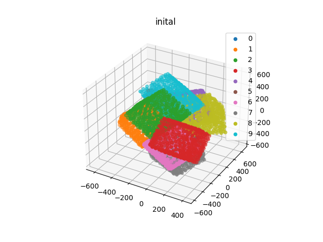

# Implementation of IMCP (Iterative Median Closest Point) aglorithm found in Performing Accurate Joint Kinematics From 3-D 

To create a shape model, instances of the shape must be aligned and the 
points matched inorder to run PCA on the shapes. This algorithm matches 
the points to the median of the closest points in the other shapes to eliminate the 
bias found in choosing a "root shape."

This has only been tested on cubes. The variation along any axis of a cube is very
similar. Futher testing on the bone segmentations once they are ready will be needed
to show correctness.

TestShapeRegistration.py generates these cubes and runs IMCP and prints the results.

The initial cubes are randomly rotated and translated. As shown in figure 1

The model then outputs the points, their rigid transformations with respect to the
median shape, and a membership map.

The final cubes are shown in figure two

The median shape is also found

We suspect these results will be better with bone shapes. It would also
be nice to devise a measure of goodness of fit. May involve making point clouds 
where the correspondance between points is known a priori.